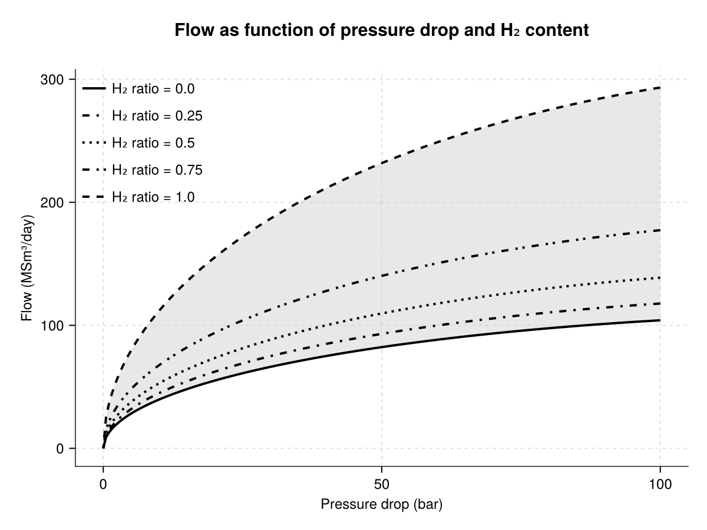
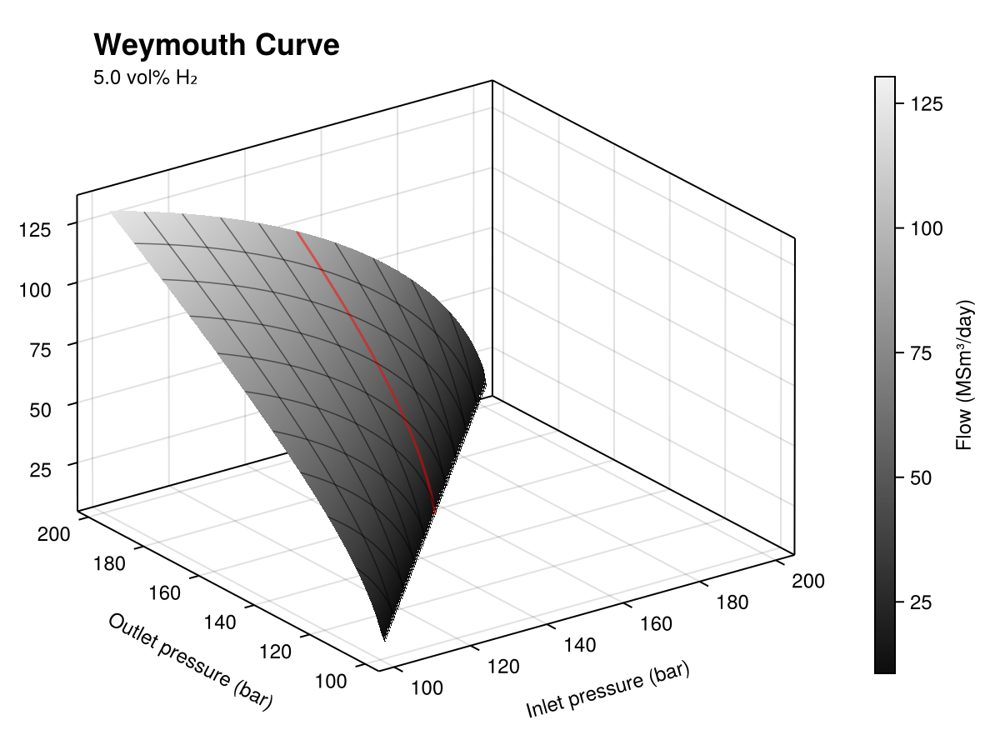
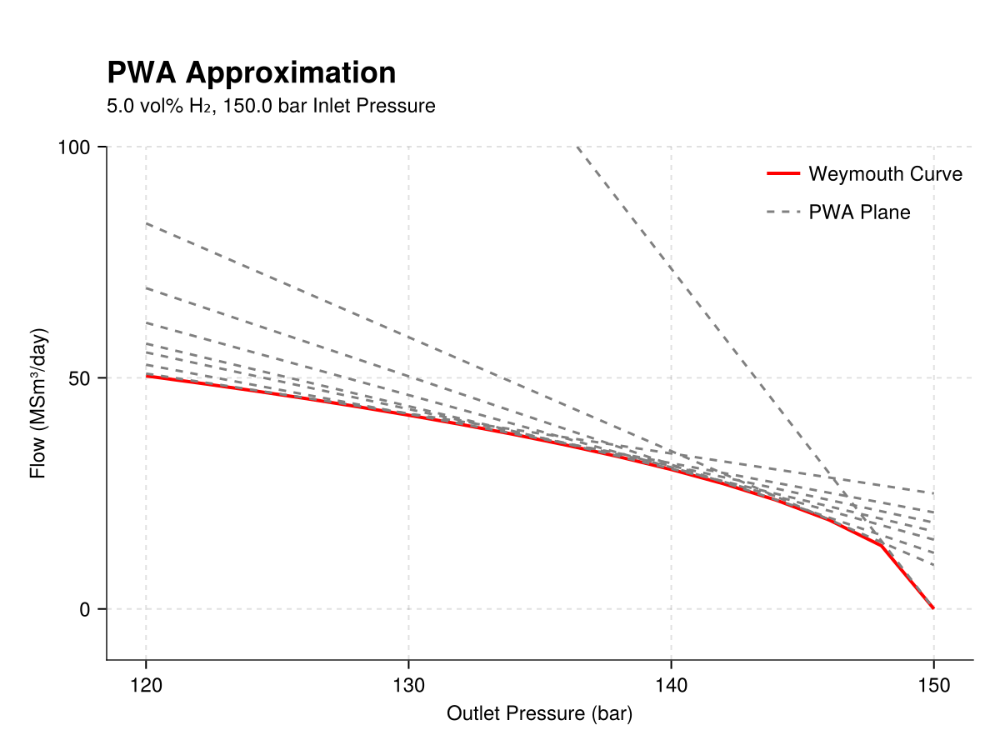

# [Theoretical Background](@id method)

```@index
Pages = ["method.md"]
```

The following sections describe the two methodologies employed to solving the admixing problem in gas networks.

## [Pooling Problem](@id method-pooling)

The pooling problem captures how different gas sources mix as they move through a network. Because sources may inject different gas types (or “commodities”), the resulting model is naturally **multi-commodity**, and it becomes necessary to track and constrain mixture composition at intermediate nodes and at terminals.

We define a directed graph ``G = (N, A)``, where ``N`` is the set of nodes and ``A`` the set of arcs. Each arc ``(i,j) \in A`` has a known capacity ``b_{(i,j)}``. Let us denote the out-neighbours of node ``i`` by ``N^+_{i} = \{j \in N : (i,j) \in A\}`` and the in-neighbours by ``N^-_i = \{ j \in N : (j, i) \in A\}``. We distinguish:

- **Sources** ``S``: nodes with no incoming arcs (``N^-_s = \emptyset`` for ``s \in S``).
- **Terminals** ``T``: nodes with no outgoing arcs (``N^+_t = \emptyset`` for ``t \in T``).
- **Pooling Nodes** ``I``: nodes where incoming flows are blended linearly, meaning the proportion (or "quality") of each commodity at ``n``is a weighted average of upstream proportions, with weights given by the incoming arc flows. (``I = N \setminus (S \cup T)``)

Let ``K`` denote the set of commodities. The parameter ``q^k_s`` represents the proportion of the commodity ``k`` injected from source ``s``. This parameter equals 1 if source ``s`` supplies commodity ``k`` and 0 otherwise. For each node ``n \in N \setminus S``, the parameters ``\overline{q}^k_n`` and ``\underline{q}^k_n`` define the maximum and minimum proportion bound, respectively. 

The pooling problem extension in EMX will assign flow values that, in addition to the minimisation of the net present value, the quality bounds at terminals and pooling nodes are respected. The extension was defined to allow the definition of *generalised pooling problem*, allowing pool-to-pool and source-to-terminal connections. As such, qualities depend on recursive mixing and can lead to much harder nonconvex problems. 

The formulation implemented in `EnergyModelsGasNetworks` is based on the multi-commodity flow formulation in [alfaki_multi-commodity_2013](@cite). In this formulation, we track source contributions through the network using the variable ``y^s_i``, interpreted as the fraction of flow at node ``i`` that originates from source ``s``.

### Mixing recursion

The proportion of flow at node ``i \in I`` from source ``s`` is calculated as follows:

``
    y_i^s = \frac{\sum_{i \in N^-_i} f_{(j, i)} y^s_j}{\sum_{i \in N^-_i} f_{(j,i)}}, \ \forall i \in I, \forall s \in S_i
``

where ``S_i`` are the source nodes who are connected to arcs that reach ``i``. 

### Quality constraints

Furthermore, the quality bounds are guaranteed by:

``
    \sum_{j \in N^-_t} \sum_{s \in S_j} (q^k_s - \overline{q}^k_t) y^s_j f_{(j,t)} \leq 0, \ \forall t \in T
``

``
    \sum_{j \in N^-_t} \sum_{s \in S_j} (q^k_s - \underline{q}^k_t) y^s_j f_{(j,t)} \geq 0, \ \forall t \in T
``

Other constraints considered are the nodal flow balance and capacity limits at nodes and links.

## [Flow-Pressure Problem](@id method-flowpress)

Whereas pooling focuses on composition tracking, the flow–pressure problem focuses on the physics that determines which flows are feasible given pressure bounds and pipeline characteristics. For blended gases, the pressure–flow relationship depends on composition, so the composition variables from pooling feed directly into the parameters used in the flow-pressure constraints.

One main consideration when modelling steady-state network optimisation models is to capture the relationship between the pipeline flows and the pressure drop. The three fundamental flow equations (i.e., mass conservation, momentum conservation and equation of state) form a system of nonlinear partial differential equations which are too complex to be included in optimisation models. To tackle this limitation, EMX captures flow-pressure relationship using the Weymouth equation, which simplifies the laws and assumes a steady-state system. The **Weymouth equation** is expressed as:

``    
Q^2 = W (p_{in}^{2} - p_{out}^2)
``

where ``W`` is the Weymouth constant:

``
W = \frac{D^5}{KTfLzg}
``

``Q`` is the flow through the pipeline, ``p_{in}`` and ``p_{out}`` are the pressures at the begining and end of the pipe, ``D`` and ``L`` are the inside diameter and length of the pipe, ``K`` is a global constant, ``T`` is the gas temperature, ``f`` is the Darcy-Weisbach friction factor in the pipeline, while the ``z`` and ``g`` are the compressibility and specific gravity of the gas. 

The compressibility and specific gravity parameters in the Weymouth constant depend on the gas composition, while the rest of the parameters are pipe specific.

In pipes transporting single gases, like pure methane, the Weymouth equation is linearised using the first-order Taylor approximation (Rømo et al. 2009). The outer approximation of Eq.\ref{eq:Weymouth} used in EMX is as follows:

``    
Q_{ij} \leq W_{ij} (\frac{PIN_{ijl}}{\sqrt{PIN_{ijl}^2-POUT_{ijl}^2}} p^{in}_{ij} - \frac{POUT_{ijl}}{\sqrt{PIN_{ijl}^2-POUT_{ijl}^2}}p^{out}_{ij})
``

This approximation is suitable for transmission networks given that pressures are high and variation in pressure are small relative to absolute pressure, which makes the Weymouth already close to linear and there are no low-flow regimes narrowing the upper end of feasible flows. This basically implies that the Taylor is an accurate approximation at transmission networks' regimes.

Moreover, single gases implies that ``z``and ``g`` remain constant across system, and, therefore, ``W``remains stable.

With `EnergyModelsGasNetworks`, we can also analyse the admixing problem where pipelines can transport blended gases (e.g., natural gas and hydrogen). In this case, the Taylor approximation is not enough for a precise representation of the flows. To tackle this, we developed a new methodology that allows reformulating the Weymouth equation for blended gases, specifically methane and hydrogen.

!!! info The following study is tailored to hydrogen and methane blends.

At constant pressure drop, the addition of hydrogen in the mixture increases the flow rate of the gas (non-linear increase) [galyas_effect_2023](@cite). For instance, additions of 10 and 20 mol\% induces a flow increase of approximately 4 and 9\%, respectively; while transporting pure hydrogen implies a 165\% [galyas_effect_2023](@cite).



*Figure 1: Representation on how hydrogen injection changes flow capacity at given pressure drops. Different ``\text{H}_2`` ratios are shown for sensitivity analysis.*

The increase in flow is primarily due to the decrease in specific gravity, `g` , resulting from the addition of hydrogen. The specific gravity is calculated as the fraction of the gas molecular weight and the molecular air of air:

``
    g^{gas} = \frac{M^{gas}}{M^{air}}
``

Since the molecular weight of methane (16.04) is eight times greater than that of hydrogen (2.02), adding hydrogen significantly lowers the specific gravity of the blend. In contrast, there is a minor decrease in the compressibility factor, which as a negligible effect on the final flow of the gas [galyas_effect_2023](@cite).

The Weymouth constant from Equation \ref{eq:WeymouthCt} can be therefore reformulated as 

``    
K = \frac{D^5}{KTfLz}
``

``
    W = K \frac{1}{g^{mix}} = K \frac{\sum_{i=1}^{n}w_iM^i}{M^{air}}
``

such that the compressibility factor remains to that of the natural gas, despite hydrogen injections, and the specific gravity can be written as a function of the molecular weight of the mixture (weighted sum of the molecular weight of its components). As such, ``K`` is a composition-independent Weymouth constant that aggregates pipe and operating parameters, while the effect of gas composition is accounted through the specific gravity ``g^{mix}``.

`EnergyModelsGasNetworks` reformulates automatically the Weymouth equation for pipes carrying blended gases by calculating the constant ``K`` based on an input Weymouth constant and the volumetric proportion of hydrogen. Then, it defines a convex set by seting the hypograph of the reformulated Weymouth equation:

``  
f \leq \sqrt{K \frac{\sum_{i=1}^{n}w_iM^i}{M^{air}} (p_{in}^{2} - p_{out}^2)}
``

The weight of each component becomes a decision variable in the model from the pooling problem. 

To summarise, `EnergyModelsGasNetworks` is able to determine whether to apply the Taylor approximation or the PWA depending on the type of gas (i.e., blend or single gas) flowing through a pipeline.

### [Linearisation of the reformulated Weymouth equation](@id method-flowpress-lin)

The reformulated Weymouth equation introduces an additional variable through the coefficient ``K``. This coefficient is affine in the mixture weights and remains nonnegative under physical bounds. On the physical operating conditions (inlet pressure ``\geq`` outlet pressure, nonnegative pressures and flows), the resulting pressure–flow relation at a given hydrogen percentage is smooth and monotonic (see Figure \ref{fig:3dflowpress}. 



*Figure 2: Surface flow as a function of inlet and outlet pressures for 5 vol-% hydrogen concentration and ``W = 0.3``*

To obtain a linear formulation, we approximate the nonlinear surface using piecewise-affine (PWA) outer approximations based on tangent planes. The PWA was performed using the julia package [PiecewiseAffineApprox.jl](https://github.com/sintefore/PiecewiseAffineApprox.jl) developed by SINTEF Industry. This will define an outer relaxation of the nonlinear relation. Note that adequate number of planes should be defined to ensure a proper approximation tightness to the curve.



*Figure 3: Example of the PWA approximation of the Weymouth curve. The figure shows the flow with respect to the outlet pressure assuming 5 vol-% hydrogen concentration and a fixed inlet pressure of 150 bars*


## [References](@id method-ref)
```@bibliography
Pages = ["method.md"]
```